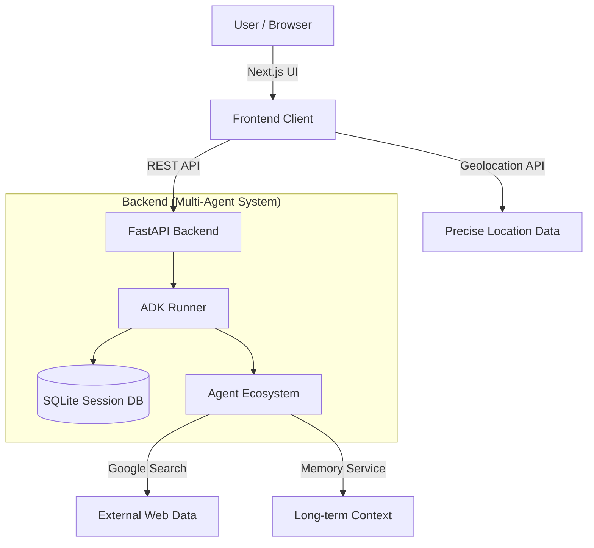
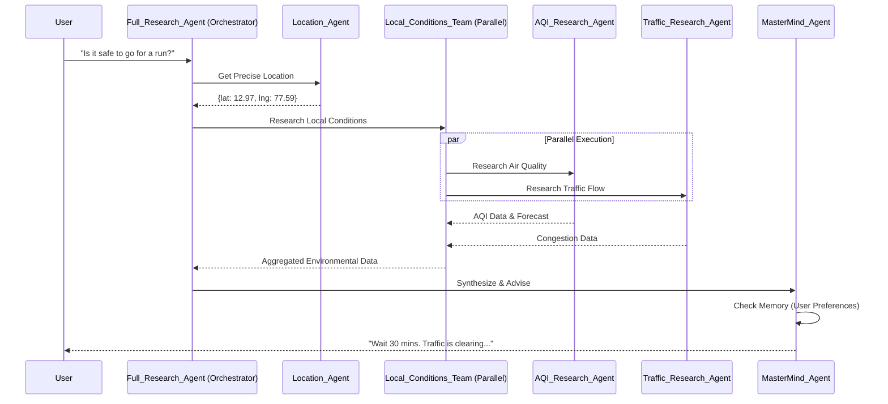
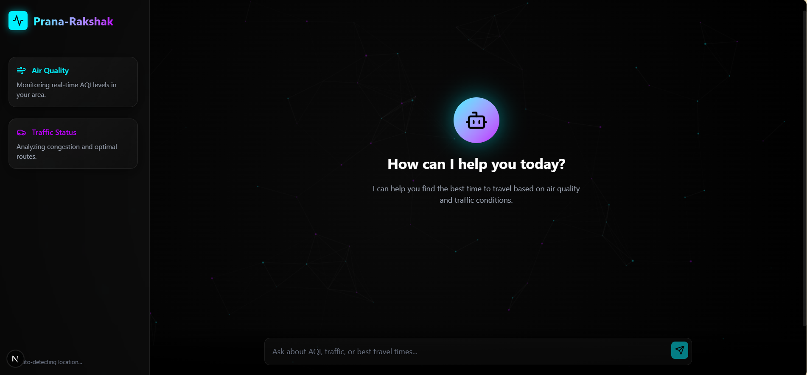

# Prana-Rakshak 🛡️
> **"Breath Guardian"** — An Intelligent Multi-Agent System for Environmental Health.

**Prana-Rakshak** (formerly Traffic Sathi) is a cutting-edge, full-stack AI application designed to bridge the gap between environmental data and daily life. By correlating real-time air quality (AQI) with traffic patterns, it empowers users to make smarter, healthier decisions about their outdoor activities.

---

## 🌍 The Vision & Need

### The Problem
Urban residents are constantly exposed to invisible hazards. While we have apps for traffic and separate apps for weather, there is no unified intelligence that says, *"Don't go for a run now; traffic congestion on Main Street is causing a spike in PM2.5 levels."* People lack actionable, correlated insights.

### The Solution
**Prana-Rakshak** acts as your personal environmental guardian. It doesn't just show data; it **researches** it. Using a sophisticated multi-agent architecture, it actively investigates local conditions, understands the causal relationship between traffic and pollution, and provides conversational, human-centric advice.

---

## 🏗️ Architecture

Prana-Rakshak utilizes a **Client-Server** architecture powered by **Google's Agent Development Kit (ADK)**.

### System Overview



### Multi-Agent Workflow
The core intelligence lies in the **hierarchical agent flow**, utilizing both **Sequential** and **Parallel** execution patterns for maximum efficiency.



---

## 📸 Application Walkthrough

### 1. Seamless Onboarding
The application greets you with a stunning, glassmorphic interface. It immediately requests permission to access your precise browser geolocation for hyper-local accuracy.



### 2. Intelligent Research
Ask natural questions like *"What's the situation outside?"*. The system dispatches its agents to research AQI and Traffic simultaneously.


### 3. Comprehensive Insights
The response isn't just text. It includes rich, interactive cards for Air Quality and Weather, along with a detailed synthesis of how traffic conditions are impacting the air you breathe.


### 4. Contextual Memory
The system remembers context. You can ask follow-up questions like *"What about later tonight?"* without repeating your location or previous details.


---

## 🛠️ Technical Stack

### Frontend 💻
*   **Framework**: Next.js 15 (App Router)
*   **Styling**: Tailwind CSS v4, Glassmorphism Design
*   **Animations**: Framer Motion
*   **Icons**: Lucide React

### Backend ⚙️
*   **Core**: Python 3.10+, FastAPI
*   **AI Framework**: Google ADK (Agent Development Kit)
*   **LLM**: Google Gemini 2.5 Flash Lite
*   **Database**: SQLite (`aiosqlite`) for Session Persistence
*   **Tools**: `ipinfo.io` (IP Geolocation), Google Search (Research)

### Key ADK Concepts Used
*   **Sequential Agents**: For controlling the logical flow of research (Location -> Research -> Synthesis).
*   **Parallel Agents**: For running AQI and Traffic research concurrently, reducing latency by ~50%.
*   **Custom Tools**: `get_precise_location` bridges the gap between the LLM and real-world coordinates.
*   **Memory Service**: `InMemoryMemoryService` allows the agent to recall past user interactions.

---

## 🚀 Getting Started

### Prerequisites
*   Python 3.10+
*   Node.js 18+
*   Google GenAI API Key

### 1. Backend Setup
```bash
cd backend
python -m venv venv
# Activate venv (Windows: venv\Scripts\activate, Mac/Linux: source venv/bin/activate)
pip install -r requirements.txt

# Create .env file
echo "GOOGLE_API_KEY=your_key_here" > .env
echo "IPINFO_TOKEN=your_token_here" >> .env

# Run Server
python -m app.main
```

### 2. Frontend Setup
```bash
cd frontend
npm install
npm run dev
```

Visit `http://localhost:3000` to start your journey with Prana-Rakshak!

---

## 🤝 Contributing
Contributions are welcome! Please fork the repository and submit a pull request.

---
*Built with ❤️ for the Google Agents Intensive Hackathon.*
